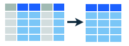
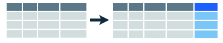
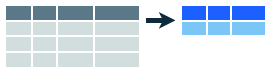
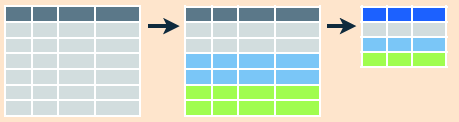
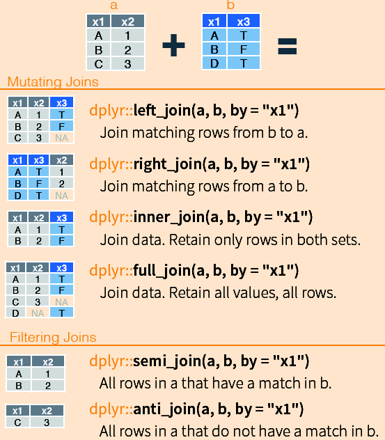

```{r, echo = FALSE, message = FALSE}
knitr::opts_chunk$set(collapse = T, comment = "#>")
options(dplyr.print_min = 4L, dplyr.print_max = 4L)
```

### Libraries needed:

```{r, message = FALSE}
library(readr)
library(dplyr)
library(lubridate)
```

# Basic dataframe manipulations

In the following tutorial we are using functions in the `dplyr`-package. As is stated in the [Introduction to dplyr](https://cran.rstudio.com/web/packages/dplyr/vignettes/introduction.html):

> When working with data you must:
>
>* Figure out what you want to do.
>
>* Describe those tasks in the form of a computer program.
>
>* Execute the program.
>
>The dplyr package makes these steps fast and easy:
>
>* By constraining your options, it simplifies how you can think about common data manipulation tasks.
>
>* It provides simple "verbs", functions that correspond to the most common data manipulation tasks, to help you translate those thoughts into code.
>
>* It uses efficient data storage backends, so you spend less time waiting for the computer.
>
> dplyr can work with data frames as is, but if you're dealing with large data, it's worthwhile to convert them to a `tbl_df` (as done above): this is a wrapper around a data frame that won't accidentally print a lot of data to the screen.

The `dplyr`-package aims to provide a function for each basic verb of data manipulation:

* `select()`: Selects variable(s) (column(s)) by name
* `rename()`: Renames variable(s) (column(s))
* `filter()`: Returns row(s) with matching conditions
* `slice()`: Selects row(s) by position - normally not very useful
* `arrange()`: Arrange rows by variables. Equivalent to "sort"
* `distinct()`: Select distinct/unique rows
* `mutate()`: Add new variables and preserves existing varibles
* `transmute()`: Add new variable but drop exisiting variables
* `summarise()`: Summarise multiple values to a single value
* `sample_n()`: Sample n rows from a table
* `sample_frac()`: Sample n rows from a table

The following structure of the text is inspired by the above cited dplyr-tutorial. Any sentences that are taken directly from that text are quoted.

The dplyr [cheat sheet](https://www.rstudio.com/wp-content/uploads/2015/02/data-wrangling-cheatsheet.pdf). The images used in this document are taken from this sheet.

## The data

```{r}
d <- read_csv("http://www.hafro.is/~einarhj/data/fish.csv") %>%
  full_join(read_csv("http://www.hafro.is/~einarhj/data/stations.csv"))
glimpse(d)
```

## Operating on variables (columns)

### Select variables by name:



"Often you work with large datasets with many columns but only a few are actually of interest to you. `select()` allows you to rapidly zoom in on a useful subset."

```{r}
select(d, sample.id, station.id)
```

Note that in the above code the results is just passed to the console. I.e. the subset of the data is __not__ stored as object in your working environment. For that one needs to do:
```{r}
x <- select(d, sample.id, station.id)
```

In this document we will only resort to the latter when needed.

Select all columns between long and depth (inclusive)
```{r}
select(d, date:temperature)
```

Select all columns except those from long to depth (inclusive)
```{r}
select(d, -(date:temperature))
```

<div class="panel panel-warning">
<div class="panel-heading">A note on piping `%>%`</div>
<div class="panel-body">

In the `select` function the first argument is the dataframe you want to manipulate (here the fish dataframe). Using the piping function (`%>%`) one could have written the above as (results not shown):

```{r, eval = FALSE}
d %>% select(sample.id, station.id)
d %>% select(date:temperature)
d %>% select(-(date:temperature))
```

__We strongly urge you to adapt the pipe convention. And this will be adhered to as much as possible in what follows__

</div>
</div>

"There are a number of helper functions you can use within `select()`, like `starts_with()`, `ends_with()`, `matches()` and `contains()`. These let you quickly match larger blocks of variables that meet some criterion. See `?select` for more details."

### Rename variables with `rename()`

Renaming columns (results not shown):
```{r, eval = FALSE}
d %>% rename(depth.in.meters = depth)
```

Combining the `rename` and the `select` function:
```{r}
d %>%
  rename(length.in.centimeters = length,
         depth.in.meters = depth) %>%
  select(sample.id, length.in.centimeters, depth.in.meters)
```

In the above case you had in the second line to type in the long names. If you are a minimalist you would do (results not shown):

```{r, eval = FALSE}
d %>%
  rename(id = sample.id,
         l = length,
         d  = depth) %>%
  select(id, l, d)
```

## Subset observations (rows)`


### Filter rows that meet logical criteria

`filter()` allows you to select a subset of rows in a data frame. The arguments are logical expressions that filter the data frame:

For example we can select only species coded as 1:

```{r}
d %>% filter(species == 1)
```

Selecting species 1 or 5:
```{r, eval = FALSE}
d %>% filter(species == 1 | species == 5)
```

The `|` stands for __or__.

A more comphrensive syntax could be:
```{r, eval = FALSE}
d %>% filter(species %in% c(1,5))
```

Species 1 and 5, only females:
```{r}
d %>% filter(species %in% c(1,5), sex == "F")
```

A list of logical operators that are useful when filtering data:
```
<       # less than 
<=      # less than or equal to 
>       # larger than 
>=      # larger or equal to 
==      # equal to 
!=      # no equal to 
x | y   # x or y
x & y   # x and y
%in%    # value matching
```

### Extract rows by position

To select rows by position, use `slice()`:

```{r}
d %>% slice(1001:1002)
```

The above selects rows 1001 and 1002 from the total rows of `r nrow(d)`. This function is most useful in conjuntion with other verbs.

Check also:
```{r, eval = FALSE}
?sample_n
?sample_frac
?top_n
```

### Select distinct/unique rows `distinct()`

" A common use of `select()` is to find the values of a set of variables. This is particularly useful in conjunction with the `distinct()` verb which only returns the unique values in a table."
```{r}
d %>%
  select(sample.id, date:temperature) %>%
  distinct()
```

In the above we have selected column associated with station information and extracted only the unique values (there are `r length(unique(d$sample.id))` unique stations in the dataframe).

### Reorder rows with `arrange()`

`arrange()` works similarly to `filter()` except that instead of filtering or selecting rows, it reorders them (equivalent to sort in Excel). It takes a data frame, and a set of column names (or more complicated expressions) to order by.

```{r}
d %>%
  select(sample.id, date:temperature) %>%
  distinct() %>%
  arrange(depth)
```

Here the data are reordered by depth. Hence the top 4 lines in the output "shows" the shallowest stations along with the other information.

Use `desc()` to order a column in descending order:

```{r, eval=FALSE}
d %>%
  select(sample.id, date:temperature) %>%
  distinct() %>%
  arrange(desc(depth))
```

Check out the help file for `desc` by typing `?desc`.

Instead of using `desc` we could instead put a minus sign in front of the variable depth to get the same results (not shown):
```{r, eval = FALSE}
d %>%
  select(sample.id, date:temperature) %>%
  distinct() %>%
  arrange(-depth)
```


## Make new variables



Besides selecting sets of existing columns, it's often useful to add new columns that are functions of existing columns.  This is the job of `mutate()`. E.g. since not all measured fish are weighted even though length is always recorded we can gestimate the weights from length using some constants:
```{r}
d %>%
  select(length, ungutted.weight) %>%
  mutate(derived.weight = 0.01 * length^3)
```

One can also change existing variables, here one converts temperature from Celius to Kelvin:
```{r}
d %>%
  select(sample.id, temperature) %>%
  mutate(temperature = temperature + 273.15) %>%
  arrange(temperature)
```

## Summarise multiple values to a single value `summarise()`



An example:
```{r}
d %>% 
  filter(!is.na(length)) %>%
  summarise(no.measured   = n(),
            no.stations   = n_distinct(sample.id),
            no.species    = n_distinct(species),
            mean.length   = mean(length),
            sd.length     = sd(length),
            no.big.fish   = sum(length > 130))
```

Get the number of measurement for each species:
```{r}
d %>% count(species)
```

## Summarise data by group



Summarise and mutate are somewhat useful on their own but become
much more useful when combined with a `group_by` statement. This approach is often called 'split - apply - combine'. As stated by [Hadley](https://cran.rstudio.com/web/packages/dplyr/vignettes/introduction.html):

> These verbs are useful on their own, but they become really powerful when you apply them to groups of observations within a dataset. In dplyr, you do this by with the `group_by()` function. It breaks down a dataset into specified groups of rows. When you then apply the verbs above on the resulting object they'll be automatically applied "by group". Most importantly, all this is achieved by using the same exact syntax you'd use with an ungrouped object.
>
> Grouping affects the verbs as follows:
>
> * grouped `select()` is the same as ungrouped `select()`, except that grouping variables are always retained. 
>   
> * grouped `arrange()` orders first by the grouping variables
>
> * `mutate()` and `filter()` are most useful in conjunction with window 
  functions (like `rank()`, or `min(x) == x`). They are described in detail in 
  `vignette("window-functions")`.
>  
> * `sample_n()` and `sample_frac()` sample the specified number/fraction of
  rows in each group.
>  
> * `slice()` extracts rows within each group.
>  
> * `summarise()` is powerful and easy to understand, as described in 
  more detail below.

In the following example, we "split" the dataset into individual species and then summarise for each species various statistics:

```{r}
d %>% 
  filter(!is.na(length)) %>%
  group_by(species) %>%
  summarise(no.measured   = n(),
            no.stations   = n_distinct(sample.id),
            mean.length   = mean(length),
            no.length_bin = n_distinct(length),
            no.big.fish   = sum(length > 130))
```

## Combine dataset



```{r echo = FALSE}
options(dplyr.print_min = 10L, dplyr.print_max = 10L)
```

```{r}
st <- data_frame(sample.id = c(1,       2,    3,    4),
                 year      = c(2014, 2014, 2015, 2015))
fi <- data_frame(sample.id = c(1,   1,  3,  4,   5),
                 species   = c(1,   2,  1,  1,   3),
                 length    = c(10, 15,  5, 10, 100))
st %>% left_join(fi)
fi %>% left_join(st)
st %>% right_join(fi)
st %>% inner_join(fi)
st %>% full_join(fi)
```
